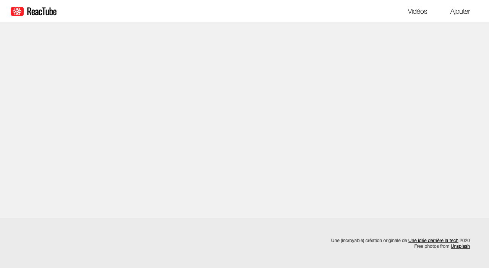
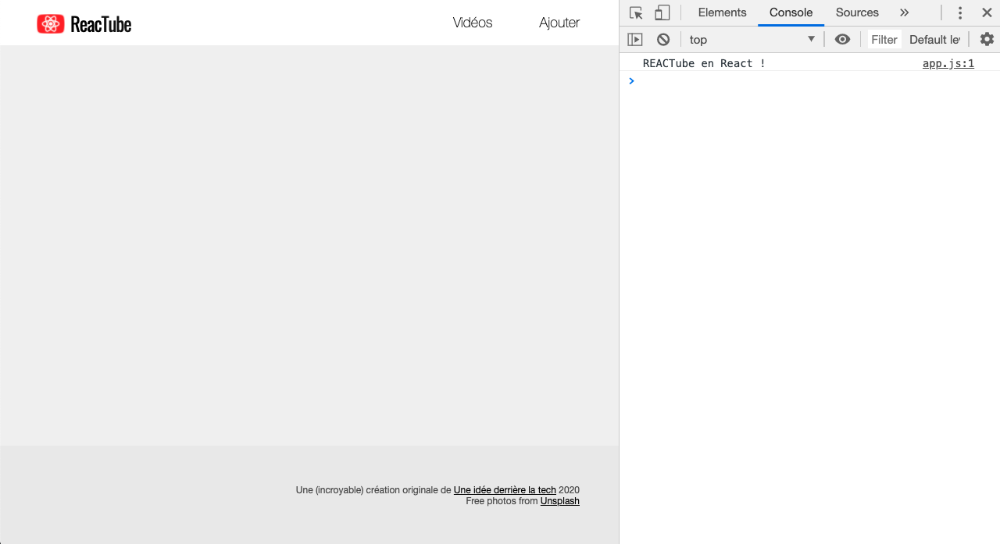

# A. Préparatifs <!-- omit in toc -->

## Sommaire <!-- omit in toc -->
- [A.1. Récupération du projet](#a1-récupération-du-projet)
- [A.2. Configuration de Prettier](#a2-configuration-de-prettier)
- [A.3. Outils de dev](#a3-outils-de-dev)
- [A.4. Installation de React](#a4-installation-de-react)
- [A.5. Lancement de l'application](#a5-lancement-de-lapplication)

## A.1. Récupération du projet
**Ce repo contient une solution commentée du précédent TP.** <br>
Pour ce TP vous pouvez soit repartir de vos fichiers du précédent TP (si vous l'aviez terminé et que le formateur a validé que tout était correct notamment au niveau de la config Babel et webpack) ou bien fork+clone ce repo et vous en servir comme base pour ce TP.

*Si vous repartez de vos fichiers, **pensez à faire un `git pull`** pour récupérer les dernières modifications du repo (probablement des modifs de CSS ou des corrections de dernière minute).*

1. **Commencez par faire un fork du TP :**
	- soit en cliquant sur le bouton `"Créer une divergence"` (_`"Fork"` sur la version anglaise de gitlab_)
	- soit en vous rendant directement sur https://framagit.org/cours-react/tp3/-/forks/new

	**⚠️ ATTENTION :** Choisissez de placer le fork **dans votre profil utilisateur** et vérifiez que le repo est **bien en mode "privé"**

2. **Ajoutez moi en tant que "reporter" pour que j'ai accès à votre code :** dans le menu de gauche, cliquez que `"Membres"`, et entrez `@tf` comme nom d'utilisateur, et donc `"reporter"` comme rôle.

3. **Récupérez ensuite les fichiers de ce TP grâce à Git : clonez votre fork dans un dossier de votre choix** :
	```bash
	mkdir ~/tps-react
	git clone https://framagit.org/<votre-username>/tp3.git ~/tps-react/tp3
	```
	> _**NB :** Comme pour le TP1, ici je clone dans mon dossier `/home/thomas/tps-react/tp3`. **Si vous êtes sous windows faites attention au sens des slashs et au caractère `"~"`** qui représente le dossier de l'utilisateur sur système unix. Si vous êtes sous windows utilisez **Git bash** (qui comprend cette syntaxe) ou si vous tenez vraiment à utiliser **cmd** pensez à adapter !_

	> _**NB2 :** Comme pour le TP1 aussi, si vous préférez **cloner en SSH** pour ne pas avoir à taper votre mot de passe à chaque fois, renseignez votre clé SSH dans votre [compte utilisateur gitlab](https://framagit.org/profile/keys) et clonez à partir de cette URL : `git@framagit.org:cours-react/tp3.git`_

4. **Ouvrez le projet dans VSCodium** (pour les différentes façon d'ouvrir le projet relisez les [instructions du TP1](https://framagit.org/cours-react/tp1/-/blob/master/A-preparatifs.md#a3-ouvrir-le-projet-dans-vscodium) )
	```bash
	codium ~/tps-react/tp3
	```

5. **Installez les paquets npm nécessaires au projet** notamment le compilateur [Babel](https://babeljs.io).<br>
	Ouvrez un terminal intégré à VSCodium (<kbd>CTRL</kbd>+<kbd>J</kbd> *(PC)* / <kbd>CMD</kbd>+<kbd>J</kbd> *(Mac)*) et tapez juste :
	```bash
	npm install
	```

	> _**NB :** Vous noterez qu'on ne précise pas les paquets à installer. npm va en effet les déterminer **automatiquement** à partir du contenu du fichier `package.json` et plus particulièrement à partir des sections `"dependencies"` et `"devDependencies"` qui indiquent quels sont les paquets qui ont été installés précédemment._
	>
	> **Magique !** 🙌


## A.2. Configuration de Prettier


_**Lors des précédents TP, vous avez en principe installé l'extension Prettier dans VSCodium.**_

Prettier est un formateur de code automatique qui est le plus populaire à l'heure actuelle dans l'écosystème JavaScript.

**C'est le moment de configurer cette extension** pour l'utiliser dans notre projet.

1. **Ajoutez un dossier `.vscode` dans le dossier du TP et placez y un fichier nommé `settings.json`** avec le contenu suivant :

	```json
	{
		"[javascript]": {
			"editor.formatOnSave": true,
			"editor.defaultFormatter": "esbenp.prettier-vscode"
		}
	}
	```
2. **Créez ensuite un fichier `.prettierrc`** à la racine du TP :
	```json
	{
		"singleQuote": true,
		"trailingComma": "es5",
		"endOfLine": "lf",
		"useTabs": true,
		"arrowParens": "avoid"
	}
	```
3. **Enfin, installez le paquet npm `prettier`** dans le projet (_nécessaire pour que l'extension vscodium fonctionne_) :
	```bash
	npm install --save-dev prettier
	```
	Avec cette configuration, vos fichiers JS seront maintenant automatiquement formatés à chaque sauvegarde ! Plus besoin de vous tracasser avec les retours à la ligne, les tabulations, les espaces, tout sera géré automatiquement par Prettier !

	> _**NB :** si vous souhaitez en savoir plus sur la liste des configurations possibles, rendez vous sur https://prettier.io/docs/en/configuration.html_


## A.3. Outils de dev

Installez l'extension **React Developer Tools** :
- sur Chrome : https://chrome.google.com/webstore/detail/react-developer-tools/fmkadmapgofadopljbjfkapdkoienihi
- ou sur Firefox : https://addons.mozilla.org/en-US/firefox/addon/react-devtools/


## A.4. Installation de React


**Comme vu en cours React est une _librairie_ JS.**

Pour l'utiliser dans notre appli on va d'abord devoir récupérer le code de cette librairie. Et pour récupérer une librairie quand on fait du JS de manière sérieuse, c'est **`npm`** qu'on utilise ! \
Comme nous sommes de gens sérieux, allons y :

1. **Installez la librairie [`react`](https://www.npmjs.com/package/react) avec npm :** Dans le dossier du TP (`à la racine, là où se trouve le package.json`), lancez la commande
	```bash
	npm i react
	```
	> _**NB :** `npm i ...` est un raccourci pour `npm install ...`_

	> _**NB2 :** vous avez peut-être remarqué que contrairement aux autres packages que l'on avait installé jusque là (`babel`, `webpack`, etc.), **`react` a été ajouté dans la section `"dependencies"` et pas `"devDependencies"`** du `package.json`._
	>
	> _En effet, tous les paquets que l'on a installé précédemment ne sont utilisés que pendant la **phase de développement** (pour la compilation ou le formatage de code source) mais ne contiennent rien qui soit vraiment utilisé "dans" notre code. C'est la raison pour laquelle on avait installé tous ces paquets avec **l'option `--save-dev`** (par exemple dans le TP1, on avait fait : `npm install --save-dev @babel/core @babel/cli`, vous vous souvenez ?_ :thinking: _) ce qui avait pour conséquence d'ajouter ces paquets dans les **`"devDependencies"`**._
	>
	> _**Pour React, on n'a pas utilisé l'option `--save-dev` car on va utiliser React dans notre code, de fait il est installé dans la section `"dependencies"`.**_
	>
	> _Documentation officielle :_
	> - _dependencies : https://docs.npmjs.com/cli/v7/configuring-npm/package-json#dependencies_
	> - _devDependencies : https://docs.npmjs.com/cli/v7/configuring-npm/package-json#devdependencies_

2. **Comme vous le savez, React permet de développer des applis web mais aussi des apps mobiles** (_avec [React Native](https://reactnative.dev/)_).

	Dans notre cas il faut donc, en plus de [`react`](https://www.npmjs.com/package/react), **installer la lib [`react-dom`](https://www.npmjs.com/package/react-dom) :**
	```bash
	npm i react-dom
	```
3. Puisque l'on souhaite utiliser du JSX, il faut **permettre à Babel de compiler le JSX en JS à l'aide du preset [@babel/preset-react](https://babeljs.io/docs/en/babel-preset-react/)** (_vous vous souvenez ? Les presets sont des sortes de "dictionnaires" de traduction_) :
	```bash
	npm i -D @babel/preset-react
	```
	> _**NB :** `-D` est un raccourci pour l'option `--save-dev`_

	Ajoutez ensuite le preset `@babel/preset-react` nouvellement installé dans le fichier `.babelrc` en remplaçant la ligne `"presets"` par celle-ci
	```json
	"presets": ["@babel/preset-env", "@babel/preset-react"]
	```
4. **Supprimez tous les fichiers `.js` du dossier `src`, à l'exception du fichier `src/data.js` puis créez un fichier `src/app.js`** qui servira de point d'entrée à notre application React.

	Placez-y pour le moment juste un `console.log` :
	```js
	console.log('REACTube en React !');
	```
5. **Enfin, modifiez la configuration de webpack** pour lui indiquer que c'est ce fichier `src/app.js` qui est désormais le point d'entrée, et que le fichier de sortie s'appelle désormais `app.bundle.js`.

	> _**NB:** N'oubliez pas de **mettre à jour la balise `<script>`** du fichier `index.html` !_

## A.5. Lancement de l'application

Comme dans le précédent TP lancez un serveur HTTP et la compilation du projet dans deux terminaux côte à côte ([terminaux splittés](https://code.visualstudio.com/docs/editor/integrated-terminal#_terminal-splitting)) :

1. **Lancez un serveur http** dans un terminal intégré de VSCodium (<kbd>CTRL</kbd>+<kbd>J</kbd> *(PC)* / <kbd>CMD</kbd>+<kbd>J</kbd> *(Mac)*) :
	```bash
	npx serve -l 8000
	```

2. **Lancez la compilation de votre projet** dans un **deuxième** [terminal splitté](https://code.visualstudio.com/docs/editor/integrated-terminal#_terminal-splitting) (*le `watch` et `npx serve` doivent tourner en parallèle*) :
	```bash
	npm run watch
	```

3. **Vérifiez dans le navigateur que la page index.html s'affiche correctement** en ouvrant l'url http://localhost:8000.

	Le résultat attendu est le suivant :

	

	**Dans la console, vérifiez que le message *`"REACTube en React !"`* s'affiche bien.**

	

	> _**NB : Si la page ne s'affiche pas correctement**, vérifiez que vous avez bien lancé le serveur http dans le dossier du projet, c'est à dire celui où se trouve le fichier `index.html`. Puis vérifiez dans la `Console` ou dans l'onglet `Sources` (Chrome) ou `Debugger` (Firefox) qu'l n'y a pas d'erreur JS lorsque la page se charge._

## Étape suivante <!-- omit in toc -->
Si tout fonctionne, vous pouvez passer à l'étape suivante : [B. Un premier composant](B-premier-composant.md)