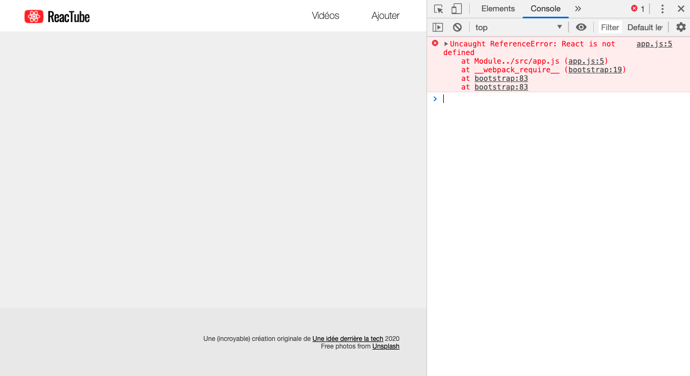

# B. Un premier composant <!-- omit in toc -->

_**Maintenant que votre environnement de développement est prêt, que votre serveur http tourne, attaquons nous au développement d'un premier composant React.**_

## Sommaire <!-- omit in toc -->
- [B.1. ReactDOM](#b1-reactdom)
- [B.2. Un premier composant](#b2-un-premier-composant)
- [B.3. Un composant = un module](#b3-un-composant-un-module)

## B.1. ReactDOM

ReactDOM est la librairie qui permet d'injecter des composants React dans une page web. Elle fournit une fonction `render()` qui permet d'associer un composant React à un élément du DOM (une balise).

1. **Dans votre fichier `src/app.js`, commencez par importer `ReactDOM` :**
	```js
	import ReactDOM from 'react-dom';
	```

2. **Toujours dans `src/app.js`, ajoutez le code suivant :**
	```js
	ReactDOM.render(
		<h1>Le Top 10 des frameworks JS</h1>,
		document.querySelector('.container > header')
	);
	```
	Comme vu en cours, ReactDOM expose une méthode statique `ReactDOM.render()` à laquelle on envoie 2 choses :
	- **le JSX** à injecter dans la page
	- et **l'élément DOM** dans lequel injecter le code HTML retourné par le JSX

3. **Rechargez la page** dans votre navigateur, vous devriez obtenir ceci :

	<a href="images/screen/screen-00.png"></a>

	Bon, contrairement à ce qu'on aurait pu espérer, **rien ne s'affiche dans la page**. 🤔

	Mais, comme vous êtes un.e vrai.e développeur.euse, vous avez bien entendu déjà les devtools ouverts et remarqué qu'on a maintenant une erreur JS à l'exécution :

	`Uncaught ReferenceError: React is not defined`

	<a href="images/screen/screen-02.png"></a>

	Mais pourquoi notre code cherche à charger `React` alors qu'on ne l'a pas utilisé dans notre code ? Et bien, c'est la faute au JSX !

	Vous vous souvenez que le JSX est en fait une syntaxe compilée ? Un raccourci ?

	Lorsqu'on écrit :
	```html
	<h1>Le Top 10 des frameworks JS</h1>
	```
	Babel compile ça en :
	```js
	React.createElement('h1', null, 'Le Top 10 des frameworks JS');
	```
	La preuve ? Ouvrez un peu le fichier `build/app.bundle.js` et rendez-vous tout à la fin du fichier (ligne 28617 environ ^^), vous y trouverez quelque chose qui ressemble à ça :
	```js
	react_dom__WEBPACK_IMPORTED_MODULE_0___default.a.render(/*#__PURE__*/
		 React.createElement("h1", null, "Le Top 10 des frameworks JS"),
		 document.querySelector('.container > header')
	);
	```
	Bien qu'on ait pas utilisé React dans notre code, **le code compilé en a quand même besoin** !

	Voilà pourquoi, à chaque fois que vous écrirez du JSX dans un module, il faudra **systématiquement importer `React`**.

4. **Maintenant qu'on sait d'où vient notre erreur, ajoutez un import au début de votre `app.js` :**
	```js
	import React from 'react';
	```
	Rechargez votre navigateur, cette fois miracle, plus d'erreur et le titre s'affiche :

	

	> _**NB :** depuis la sortie de la version 17 de React sortie fin octobre 2020, une [nouvelle méthode de compilation du JSX](https://reactjs.org/blog/2020/10/20/react-v17.html#new-jsx-transform) est sortie. Cette méthode permet de se passer de l'import de React pour utiliser du JSX !_
	>
	> _Pour l'utiliser il faut ajouter au .babelrc une option au `preset-react` comme ceci :_
	> ```json
	> {
	> 	"presets": [
	> 		"@babel/preset-env",
	> 		["@babel/preset-react", { "runtime": "automatic" }]
	> 	]
	> }
	> ```
	> _Notez que cette configuration supplémentaire ne sera plus nécessaire lors de la [sortie de Babel 8](https://github.com/babel/babel/issues/10746). Si ça vous intéresse vous trouverez plus d'infos sur cette nouvelle méthode sur le blog de react : https://reactjs.org/blog/2020/09/22/introducing-the-new-jsx-transform.html_

5. **Notez que la méthode `ReactDOM.render()` est en fait une fonction qu'on peut importer indépendamment.** À la place de `import ReactDOM from 'react-dom';` écrivez :
	```js
	import {render} from 'react-dom';
	```
	Puis à la place de `ReactDOM.render(...` écrivez juste :
	```js
	render(
		<h1>Le Top 10 des frameworks JS</h1>,
		document.querySelector('.container > header')
	);
	```

## B.2. Un premier composant

On vient de voir que l'on peut passer à `ReactDOM.render()` du code JSX tapé inline. Mais on va surtout l'employer avec des composants custom !

1. **Toujours dans le `src/app.js`** (_on mettra tout ça dans des modules à part plus tard_), **au dessus de l'appel à `render()`, créez une classe nommée `VideoDetail` comme ceci :**
	```js
	class VideoDetail extends React.Component {
		render() {
			return <h1>Le Top 10 des frameworks JS</h1>;
		}
	}
	```
2. **À la place du `<h1>` en dur utilisez le composant `VideoDetail` dans l'appel à `render()` :**
	```js
	render(
		<VideoDetail />,
		document.querySelector('.container > header')
	);
	```
	Le rendu dans le navigateur ne doit pas avoir bougé puisque le composant `VideoDetail` retourne le même JSX que ce qu'on avait mis auparavant :

	

	> _**NB :** pour vous assurer que la modif de votre code est bien prise en compte, vous pouvez modifier le JSX retourné par le composant `VideoDetail` et voir si le changement se fait bien dans le navigateur._

## B.3. Un composant = un module

Maintenant que vous avez compris le principe, déplacez la classe `VideoDetail` dans un module à part `src/VideoDetail.js`. En effet, le fichier `app.js` n'est que le point d'entrée de notre appli, le détail du code de nos composant doit être externalisé. Pensez à modifier le module `app.js` et aux `import`/`export` qui vont bien.

## Étape suivante <!-- omit in toc -->
Une fois cette partie terminée, il est temps de travailler plus en détail sur le composant `VideoDetail` : [C. Le composant VideoDetail](C-videodetail.md).