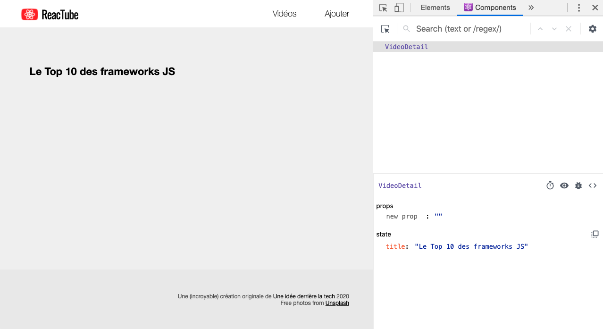
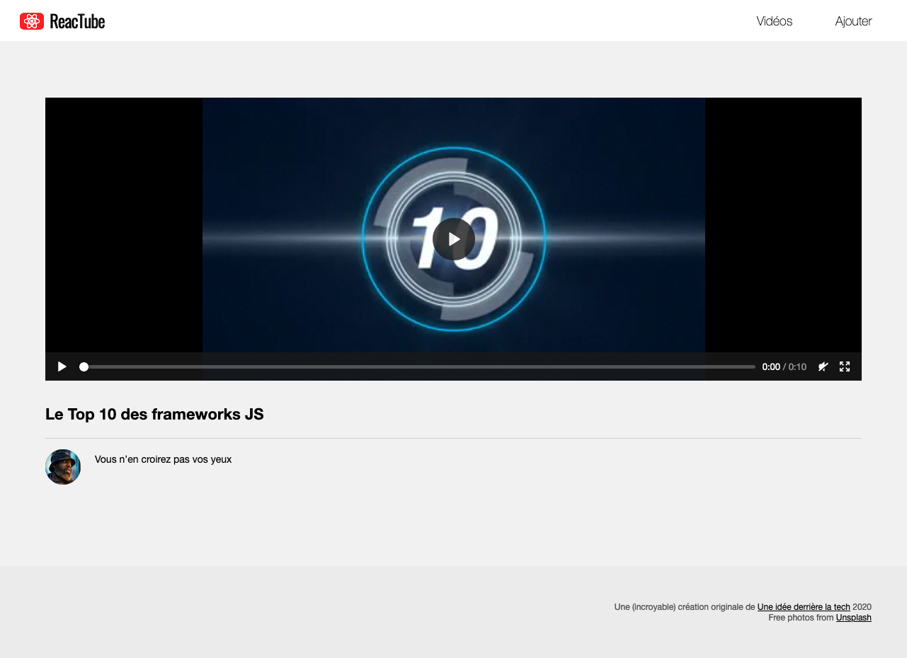

# C. Le composant VideoDetail <!-- omit in toc -->

_**Voilà, notre appli est maintenant capable d'embarquer des composants React. Voyons maintenant comment utiliser le `state` pour améliorer un peu notre composant `VideoDetail`.**_

## Sommaire <!-- omit in toc -->
- [C.1. appContainer](#c1-appcontainer)
- [C.2. Le state, c'est quoi ?](#c2-le-state-cest-quoi-)
- [C.3. Ajout du state par défaut](#c3-ajout-du-state-par-défaut)
- [C.4. React Devtools](#c4-react-devtools)
- [C.5. Finalisation du composant](#c5-finalisation-du-composant)

## C.1. appContainer

Actuellement notre fichier `index.html` contient ce code :
```html
<section class="appContainer">
	<header>
		<nav>
			<h1 class="logo">Reac<em>Tube</em></h1>
			<ul class="mainMenu">
				<li><a href="#">Vidéos</a></li>
				<li><a href="#">Ajouter</a></li>
			</ul>
		</nav>
	</header>
	<div class="container">
		<header></header>
		<div class="page">
		</div>
	</div>
</section>
```

L'idée c'est maintenant de faire en sorte que tout le contenu de la `<section class="appContainer">` soit généré avec React.

Dans cet exercice on va donc  :
- créer un nouveau composant `Menu` pour rendre le `<header><nav>...</nav></header>`
- rendre l'un en dessous de l'autre les composants `Menu` et `VideoDetail` de manière à reproduire le code HTML jusque là en dur

1. **Commencez par supprimer tout le CONTENU de la balise `<section class="appContainer">`.** Vous devriez maintenant avoir dans votre fichier `index.html` une balise vide comme ceci :
	```html
	<section class="appContainer"></section>
	```
2. **Créez un nouveau composant React nommé `Menu` et qui retourne le code html suivant :**
	```html
	<header>
		<nav>
			<h1 class="logo">Reac<em>Tube</em></h1>
			<ul class="mainMenu">
				<li><a href="#">Vidéos</a></li>
				<li><a href="#">Ajouter</a></li>
			</ul>
		</nav>
	</header>
	```

3. **Modifiez le `app.js` pour rendre à la fois le composant `VideoDetail` et ce nouveau composant `Menu` dans la `<section class="appContainer">` comme ceci :**
	```jsx
	render(
		<>
			<Menu />
			<VideoDetail />
		</>,
		document.querySelector('.appContainer')
	);
	```

	> _**NB :** le mieux ici est d'utiliser comme on le fait les [Fragments](https://reactjs.org/docs/fragments.html) pour que les deux composants se rendent côte à côte sans balise HTML (div, section, etc.) parente._

5. **Modifiez le composant `VideoDetail` pour lui faire retourner le code HTML suivant :**
	```html
	<div class="container">
		<header>
			<h1>Le Top 10 des frameworks JS</h1>
		</header>
	</div>
	```

Le rendu HTML doit rester inchangé :


## C.2. Le state, c'est quoi ?

**Pour rappel, le `state` est une propriété spéciale des composants React qui, lorsqu'elle est modifiée, re-déclenche automatiquement un `render()` de notre composant.**

C'est donc dans cette propriété qu'on stocke en général toutes les valeurs qui vont pouvoir varier au cours de l'exécution, et dont on veut qu'elles soit affichées à l'écran.

Le state est représenté par une propriété `this.state` et la première chose à faire c'est de définir sa valeur initiale (on parle aussi parfois de _"state par défaut"_).

## C.3. Ajout du state par défaut

1. **Dans votre classe `VideoDetail.js`, commencez par ajouter une propriété d'instance `state` :**

	Vous pouvez le faire de deux manières :
	- Dans le constructeur :
		```js
		class MyComponent extends React.Component {
			constructor(...args) {
				super(...args);
				this.state = {
					propriete: "valeur",
				};
			}
			//...
		}
		```
	- ou alors en utilisant la syntaxe des public fields :
		```js
		class MyComponent extends React.Component {
			state = {
				propriete: "valeur",
			};
			//...
		}
		```
	Pour ma part, je trouve cette deuxième syntaxe beaucoup plus agréable à utiliser et plus facile à lire, c'est donc celle là que je vous recommande. En revanche sachez-le, comme vu dans le [TP2 B.1.1. class & propriétés publiques](https://framagit.org/cours-react/tp2/-/blob/master/B-poo.md#b11-class-propri%C3%A9t%C3%A9s-publiques) cette syntaxe n'est pas encore dans la spec officielle (mais c'est tout comme).

2. **Configurez donc votre state avec une propriété `title`, comme ceci :**

	```js
	state = {
		title: 'Le Top 10 des frameworks JS',
	};
	```
3. **Utilisez le state dans votre render.** (_Vous vous souvenez que pour injecter des valeurs JS dans le JSX il faut utiliser les accolades `{}` ? Et que l'on fait référence à une valeur du state en utilisant `this.state.propriete` ? Si vous ne vous en souvenez pas, c'est le moment de relire le pdf du cours_ 📖). Le rendu ne doit pas avoir bougé :


## C.4. React Devtools

Maintenant que notre composant a un state, voyons un peu comment utiliser l'extension React Devtools que l'on a installée au chapitre [A.2. Outils de dev](./A-preparatifs.md#a2-outils-de-dev).

Dans la barre d'onglets des devtools de votre navigateur, ouvrez l'onglet `"Components"`, vous verrez en principe ceci :



Vous voyez le composant rendu dans la page, et son state : React Devtools détecte que le state contient une propriété `title` et sa valeur.

Essayez de modifier la valeur du state en cliquant sur le texte `"Le Top 10 des frameworks JS"` et en tapant n'importe quel texte : vous voyez que l'affichage se met à jour automatiquement ? 🙌 C'est la magie du state qui opère !

## C.5. Finalisation du composant

Ajoutez maintenant dans le state 2 autres propriétés :
- `description` avec un texte fictif
- et `file` avec la chaîne `video1.mp4`

Faites en sorte que le code retourné ressemble à ceci :
```html
<div class="videoDetail">
	<video
		style="width:100%; background-color:black"
		height="300"
		controls
		src="./uploads/video1.mp4"
	>
	</video>
	<h1>Le Top 10 des frameworks JS</h1>
	<p>Vous n’en croirez pas vos yeux</p>
</div>
```
Le résultat attendu dans le navigateur est le suivant :



## Étape suivante <!-- omit in toc -->
Une fois cette partie terminée, passons à la `VideoList` : [D. VideoList](D-videolist.md).