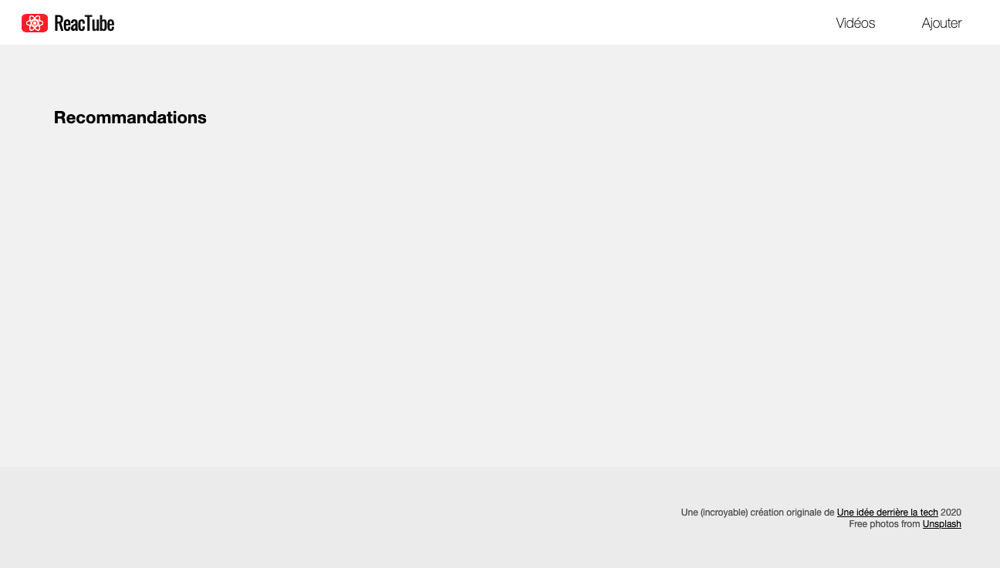
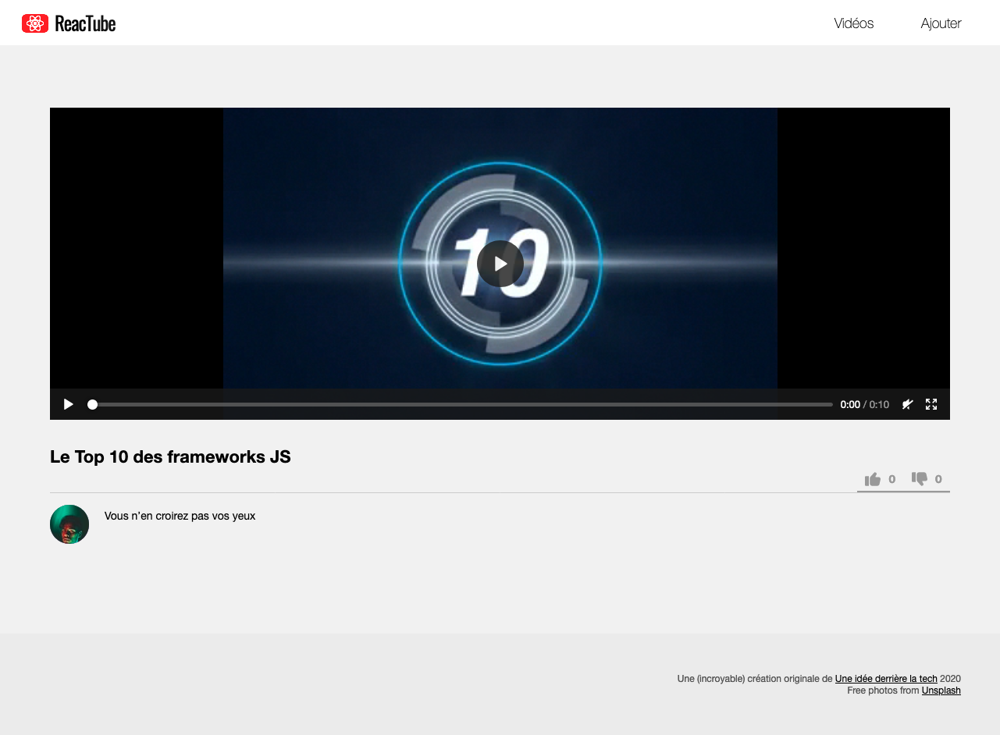

# E. Pour aller plus loin <!-- omit in toc -->

## Sommaire <!-- omit in toc -->
- [E.1. setState](#e1-setstate)
- [E.2. Optimisations de VideoDetail](#e2-optimisations-de-videodetail)
- [E.3. Les likes](#e3-les-likes)


## E.1. setState

_**On va voir dans cet exercice comment modifier le state d'un composant.**_

1. **Remplacez la valeur du state `videos` de `VideoList` par un tableau vide (`[]`).**

	Rechargez la page, normalement les vignettes ont disparu, normal.

	

2. **Ajoutez au composant `VideoList` une méthode `componentDidMount`.**

	Vous vous souvenez, cette méthode est une des méthodes du cycle de vie de React (_comme la méthode `render`_). Elle est appelée automatiquement **après** le premier affichage du composant (_apès le premier `render()` donc_).
3. **Dans cette méthode, utilisez la fonction [`setTimeout()`](https://developer.mozilla.org/fr/docs/Web/API/WindowOrWorkerGlobalScope/setTimeout) pour injecter dans le state, la liste des vidéos issues de `data` au bout de 3 secondes.**

	Rechargez la page, les vidéos doivent apparaître après ce délai.

6. **Faites en sorte que pendant la période où aucune vidéo n'est affichée, la classe CSS "is-loading" soit ajoutée à la `<div class="videoList">`.** Cette classe doit être enlevée une fois le timeout terminé.

	Pendant la phase de "loading", vous devez voir un petit loader apparaître :

	


## E.2. Optimisations de VideoDetail
1. **Le champ description devient facultatif :** la balise `<p>` qui la contient ne doit pas s'afficher s'il n'y en a pas dans le state.
2. **Faites en sorte que le composant `VideoDetail` aille chercher ses infos depuis le fichier `data.js`**
3. **Toutes les 2 secondes, la vidéo affichée dans le composant `VideoDetail` doit changer pour afficher la vidéo suivante du tableau** (utilisez pour ça la fonction [`setInterval()`](https://developer.mozilla.org/fr/docs/Web/API/WindowOrWorkerGlobalScope/setInterval))

## E.3. Les likes
Maintenant que vous êtes aguérris aux Components de React, au JSX, au state, passons à un dernier exercice : ***l'ajout de boutons de "like" 👍 / "dislike" 👎.***

1. **Commencez par désactiver/enlever le mécanisme mis en place dans l'exercice précédent E.2.3** (_changement de vidéo automatique_). En effet, ça risque d'être compliqué de tester le fonctionnement des boutons, si la vidéo n'arrête pas de changer !
1. **Ajoutez 2 propriétés dans le state du composant : `likes` et `dislikes`**, toutes les deux initialisées à 0.
2. **Ajoutez dans le `render()` de `VideoDetail` le code html des boutons :** à la place de la balise `<h1>...</h1>` retournez le code suivant :
	```html
	<header>
		<h1>Le Top 10 des frameworks JS</h1>
		<div class="likesContainer">
			<button class="like"> 0 </button>
			<button class="dislike"> 0 </button>
		</div>
	</header>
	```
	Vous devez obtenir ceci (notez les 2 boutons à droite):

	
3. **Enfin, faites en sorte que lorsque l'utilisateur clique sur les deux boutons, ça augmente les valeurs des states correspondants et que l'affichage se mette à jour !**

	> _**NB :** Pour détecter le clic sur les boutons, la technique est d'ajouter des attributs `onClick` : https://reactjs.org/docs/handling-events.html_
